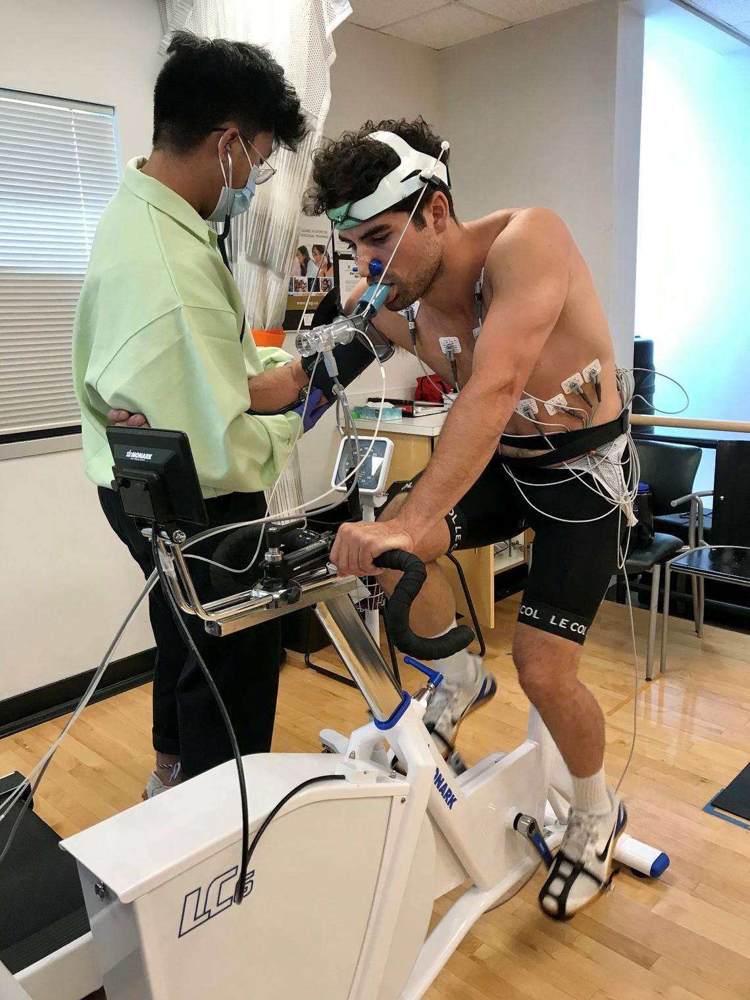

<h1 align="center">HTML demo</h1> 

Here is the link to [the first document I made in GitHub.](readme.md)  

This is image depicts a V&#775;O2 max test from the University of Calgary.    

  

done title  
done coloured text  
NEED picture to the right of some text  
done link  
done subscript text  
done hyperlink to a file in a subfolder (can be the image (instead of the link))  
done scientific notation (dot over the V or x)  
